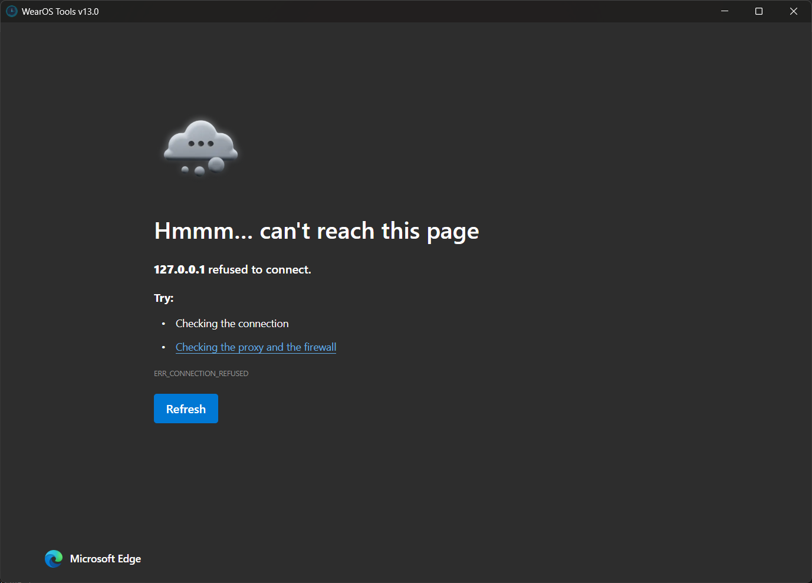

# WearOS Manager

A modern, high-performance desktop application for managing, optimizing, and customizing Wear OS smartwatches via ADB (Android Debug Bridge). Built with **Tauri v2 + Rust** on the backend and **React 19 + TypeScript + Vite + Tailwind CSS** on the frontend.



---

## 📚 Documentation & Guides

Comprehensive guides for using and extending WearOS Manager:

- 📡 **[Wireless Debugging & Pairing Guide](docs/WIRELESS_DEBUGGING_GUIDE.md)**: Instructions for connecting via Wi-Fi, pairing Wear OS 3/4/5 watches with 6-digit PINs, and device-specific notes (Galaxy Watch, Pixel Watch, OnePlus Watch 2).
- ⚡ **[Performance, Battery & Optimization Guide](docs/OPTIMIZATION_GUIDE.md)**: In-depth breakdown of Ahead-of-Time ART Dexopt compilation, animation multipliers, DPI scaling, and OEM background bloatware management.
- 🛠️ **[Developer & Architecture Guide](docs/DEVELOPMENT.md)**: System architecture, Tauri IPC command pipeline, and step-by-step instructions for adding new features.

---

## Features

- **Device Connection & Wireless Pairing**:
  - Connect via Wi-Fi (`adb connect`) or USB cable.
  - Pair modern Wear OS 3, 4, and 5 watches wirelessly using 6-digit pairing codes (`adb pair`).
  - Persistent connection history with 1-click reconnect and clear history controls.
- **Application Manager & Sideloading**:
  - Drag-and-drop single and batch APK installation with real-time progress indicators.
  - Package explorer with filters: *User Apps*, *System Apps*, *Play Store*, *Sideloaded*, and *Hidden/Uninstalled*.
  - App management: Launch, Enable/Disable, Clear Cache/Data, Force Stop, and Uninstall.
  - Integrated Universal Android Debloater (UAD-NG) support.
- **Backup & Multi-Snapshot Restoration**:
  - Full or selective extraction of installed watch applications into timestamped backup folders (`Apps_Backup/`).
  - Multi-backup browser with package inspection and selective or batch restoration.
- **Screen Mirroring & Remote Control**:
  - High-performance, low-latency watch screen mirroring and interactive control via `scrcpy`.
  - Instant screenshot capture with Preview, Copy to Clipboard, and Save to PNG.
  - Virtual D-pad remote controller with hardware keys (Power, Back, Home, Volume).
  - Text input injection from PC keyboard to watch fields.
- **Display & Audio Customization**:
  - Custom screen timeout durations (15s up to Always-On 24h).
  - Screen Density (DPI) modifier and font scale adjustment.
  - Always-On Display (AOD), Auto-Brightness, Theater Mode, and Developer Options toggles.
  - Ringtone, Notification Sound, and Alarm Sound uploads with automatic media store indexing.
  - Vibration toggles for incoming calls, notifications, and haptic touch feedback.
- **Performance & Battery Optimizer**:
  - Animation speed multiplier (1.0x, 0.5x double speed, 0.25x, 0.0x instant).
  - Ahead-of-Time (AOT) ART Dexopt bytecode compilation.
  - One-click app cache cleaner.
  - OEM background telemetry optimizer.
- **Watch Storage File Explorer**:
  - Browse `/sdcard/` directories with path breadcrumbs.
  - Upload files to watch, download to PC, create folders, and delete files.
- **Interactive ADB Console**:
  - Built-in terminal for custom ADB commands with command history navigation.
- **Internationalization (i18n)**:
  - English (EN) and Spanish (ES) localization.

## 📥 Downloads

Grab the latest release from the [Releases Page](https://github.com/SriviharReddy/wearos-manager/releases):

| Download | Type |
| :--- | :--- |
| **[`WearOS.Manager.exe`](https://github.com/SriviharReddy/wearos-manager/releases/latest/download/WearOS.Manager.exe)** | Portable Standalone Executable (No installation required) |
| **[`WearOS.Manager_1.0.0_x64-setup.exe`](https://github.com/SriviharReddy/wearos-manager/releases/latest/download/WearOS.Manager_1.0.0_x64-setup.exe)** | Windows Setup Installer (NSIS) |
| **[`WearOS.Manager_1.0.0_x64_en-US.msi`](https://github.com/SriviharReddy/wearos-manager/releases/latest/download/WearOS.Manager_1.0.0_x64_en-US.msi)** | Windows MSI Package |

---

---

## Development & Build

### Prerequisites

- [Node.js](https://nodejs.org/) (v18+) or [Bun](https://bun.sh/)
- [Rust](https://www.rust-lang.org/) (v1.75+)
- [Android Platform Tools (ADB)](https://developer.android.com/tools/releases/platform-tools)

### Running Development Mode

```bash
bun install
bun run tauri dev
```

### Building Standalone Executable

```bash
bun run tauri build
```

The compiled standalone executable will be generated at `src-tauri/target/release/wearos-manager.exe` along with Windows setup installers in `src-tauri/target/release/bundle/`.

---

## License

Distributed under the [MIT License](https://opensource.org/licenses/MIT).
